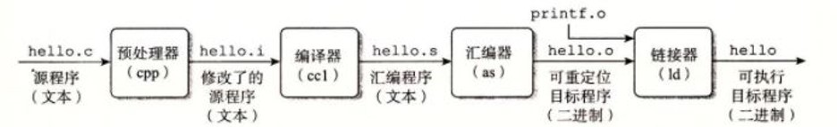

## C语言 -> 指令




将高层的C/C++语言编写的程序转换成为处理器能够执行的二进制代码的过程，一般包括四个步骤：

•预处理（Preprocessing）

•编译（Compilation）

•汇编（Assembly）

•链接（Linking）


## 性能分析

**Program execution time**

**Execution Time = (#instructions)(cycles/instruction)(seconds/cycle****)**

​                **= # instructions x CPI x TC**


**Definitions:**

CPI: Cycles/instruction

clock period: seconds/cycle

IPC: instructions/cycle = IPC

**Challenge is to satisfy constraints of:**

Cost

Power

Performance

``` 
RV最大的特点就是可扩展性和模块化

继承了RISC的特点，简单，指令等长，load/store模型，所有运算都使用resgiter来进行，不会直接对内存操作

```


## 流水线优点

Question 7.1 Explain the advantages of pipelined microprocessors.（解释下流水线处理器的优点）

流水线处理器（pipelined processors）的主要优点是更快的周期时间和时间上的并行性。在理想条件下，一个有N级的流水线处理器比非流水线处理器快N倍。速度的提升是通过额外的硬件来实现的，主要是流水线寄存器和风险处理单元。

优点

1. **更快的周期时间**：流水线处理器将指令的执行过程分为多个阶段，每个阶段由不同的硬件模块并行处理，从而大幅提高了整体处理速度。
2. **时间上的并行性**：流水线允许多条指令同时处于处理的不同阶段，这种并行处理提高了CPU的吞吐量。

成本

1. **额外的硬件**：为了实现流水线处理，需要增加流水线寄存器，这些寄存器在各个阶段之间传递中间结果。此外，还需要增加风险处理单元（hazard unit）来解决流水线中的数据冲突和控制冲突。
   

流水线寄存器用于在不同的流水线阶段之间传递数据和控制信号，而风险处理单元用于检测和处理流水线中的各种冲突，包括数据风险（data hazards）、控制风险（control hazards）和结构风险（structural hazards）。

理想与实际

在理想条件下，即没有任何流水线阻塞（pipeline stalls）或延迟，流水线处理器的速度可以接近理论上的N倍提升。然而，在实际应用中，指令间的依赖性、分支指令和内存访问延迟等因素可能导致流水线效率降低。

总结来说，流水线技术通过增加硬件资源来显著提高处理器的性能，但也需要解决相应的复杂性和潜在的效率问题。


## 流水线深度

Question 7.2 If additional pipeline stages allow a processor to go faster, why don’t processors have 100 pipeline stages?（问题 7.2 如果额外的流水线级可以让处理器运行得更快，为什么处理器不具有 100 个流水线级？）


增加流水线阶段带来了额外的顺序开销。处理器的流水线阶段越多，产生的依赖性就越多，导致更多的停顿和冲刷。这意味着即使周期时间降低，CPI（每指令周期数）也可能不断上升，直到额外的阶段提供的回报递减，甚至降低处理器的性能。

成本和挑战

1. **顺序开销**：每增加一个流水线阶段，必须处理更多的时序控制，这会增加设计和实现的复杂性。
2. **依赖性增加**：更多的流水线阶段意味着指令间的依赖性增多，导致更多的停顿（stalls）和冲刷（flushes）。这些停顿和冲刷会影响流水线的效率。
3. **功耗和成本增加**：更多的流水线阶段需要更多的流水线寄存器，这些寄存器不仅消耗更多的功率，还增加了芯片的成本。
4. **风险处理单元的复杂性增加**：随着流水线的加深，风险处理单元（hazard unit）变得更加复杂，需要处理更多的潜在冲突。这种复杂性不仅增加了设计难度，还可能进一步影响性能和功耗。

实际性能影响

尽管增加流水线阶段可以提高处理器的频率，但由于上述因素的影响，实际性能提升可能会受到限制。当增加的流水线阶段带来的性能提升不足以抵消停顿和冲刷带来的开销时，整体性能可能会下降。

总结

增加流水线阶段是一把双刃剑。虽然在理论上可以提高处理器的频率和吞吐量，但实际应用中必须权衡额外硬件成本、功耗增加以及潜在的性能损失。随着流水线加深，设计复杂性和依赖性处理变得更加重要，需要仔细优化以实现预期的性能提升。


## 冲突

Question 7.3 Describe what a hazard is in a microprocessor and explain ways in which it can be resolved. What are the pros and cons of each way?（冲突，解决方法，优缺点）

在微处理器中，冒险指的是发生在指令流水线中可能导致错误操作或行为的条件。冒险可能是由于流水线本身引起的，其中多个指令同时处于不同阶段的执行。主要有三种类型的冒险：

1. 结构冒险：当多个指令需要的硬件资源重叠时发生。例如，如果两个指令同时需要访问相同的硬件组件，如ALU（算术逻辑单元），就会产生结构冒险。

2. 数据冒险：当指令之间存在数据依赖关系，但一个指令需要的数据尚不可用，因为它是由尚未完成执行的先前指令产生的。数据冒险可以表现为读后写（RAW）、写后读（WAR）或写后写（WAW）依赖关系。

3. 控制冒险：也称为分支冒险，当条件分支指令的结果尚未确定，但基于预测的结果已经获取或部分执行了后续指令时发生。如果预测错误，将导致浪费时钟周期和错误执行。

解决每种类型的冒险的方法及其优缺点如下：

1. 结构冒险解决方案：
   - *资源复制*：这涉及复制硬件资源以消除竞争。例如，添加多个ALU或数据通路以处理同时操作。
     - *优点*：实施相对简单。通过允许更多指令同时执行，可以提高性能。
     - *缺点*：增加了硬件复杂性和成本。由于面积和功耗限制，可能并不总是可行的。

2. 数据冒险解决方案：

   - 数据停顿（Data Stall）：当一条指令需要的数据尚未准备好时，可以暂停后续的指令执行，直到数据可用。

     - 优点：简单易行，不需要对硬件进行大规模修改。

     - 缺点：会导致流水线停顿，降低了指令执行的效率，延长了程序的执行时间。

   - *前递（也称为数据旁路）*：这种技术将指令的结果直接转发到另一个需要它的指令，绕过了首先将其写入存储器的需要。

     - *优点*：有助于减少流水线停顿，提高吞吐量。相对较低的硬件开销。

     - *缺点*：增加了处理器数据路径和控制逻辑的复杂性。对于某些类型的依赖性，效果有限。

   - *软件流水线*：这涉及重新排序指令以消除数据依赖关系，或插入额外的“虚拟”指令以允许依赖指令继续执行。

     - *优点*：不需要硬件更改。通过允许更多并行性，可以提高性能。

     - *缺点*：可能需要进行重大的代码重构。不是所有代码序列都可能或有效。

3. 控制冒险解决方案：
   - *分支预测*：这种技术涉及在分支指令解析之前预测其结果，并根据预测执行指令。
     - *优点*：可以隐藏分支指令的延迟，提高总体吞吐量。可以以相对较低的硬件开销实现。
     - *缺点*：预测精度可能取决于分支模式和程序行为。错误的预测会导致执行周期的浪费。
   - *分支延迟槽*：这涉及执行分支指令后紧跟的指令，无论分支是否被采取。
     - *优点*：有助于利用分支指令后的空闲周期。实现简单。
     - *缺点*：如果分支被采取，延迟槽中的指令是不必要的，可能导致执行周期的浪费。在隐藏分支延迟方面效果有限。

总之，在微处理器中解决冒险涉及在硬件复杂性、性能改进和实现开销之间的权衡。解决方案的选择取决于特定的微体系结构、性能要求和设计约束等因素。


## 超标量处理器

Question 7.4 Describe the concept of a superscalar processor and its pros and cons.（超标量处理器的概念及其优缺点）


超标量处理器的优缺点

优点：

1. **更高的吞吐量**：超标量处理器可以实现比标量处理器更高的吞吐量。因为它们能够在一个时钟周期内执行多条指令（IPC，Instructions Per Cycle）。例如，超标量处理器可以达到小于1的每指令周期数（CPI，Cycles Per Instruction），这意味着它们可以在一个周期内执行多于一条指令。

缺点：

1. **数据路径利用率不足**：由于指令之间的依赖关系，很难充分利用超标量处理器提供的额外数据路径。指令间的依赖性会阻碍多条指令的同时执行，从而限制了潜在的性能提升。

2. **硬件复杂度增加**：超标量处理器需要比标量处理器更多的硬件。这包括数据路径的多副本、寄存器文件和内存的额外端口以及更复杂的冒险检测单元。这种增加的复杂性使得设计和实现更加困难。

3. **更高的功耗和成本**：超标量处理器中的额外和更复杂的硬件导致了更高的功耗和更高的成本。增加的功耗和成本在总体设计和部署中是重要的考量因素。


## load指令


缓存层次结构是现代计算机体系结构中的重要组成部分，通常由多级缓存组成，包括L1缓存、L2缓存、L3缓存等。这些缓存层次结构的存在旨在提高数据访问速度和系统性能，通过减少CPU和主存之间的数据传输次数来实现。下面详细解释一下缓存层次结构的利用：

1. **L1缓存**：
   - L1缓存是与CPU核心紧密集成的小型高速缓存，位于CPU核心内部。
   - 它的速度非常快，但容量较小，通常只有几KB到几十KB。
   - L1缓存主要用于存储CPU频繁访问的数据和指令，以提供快速的访问速度。

2. **L2缓存**：
   - L2缓存位于CPU核心与主存之间，通常比L1缓存容量更大，速度稍慢。
   - 它的容量通常在几百KB到几MB之间，用于存储对L1缓存中的数据进行补充和扩展的数据。

3. **L3缓存**：
   - L3缓存通常是多个CPU核心共享的，位于CPU核心和主存之间。
   - 它的容量比L2缓存更大，通常在几MB到几十MB之间，速度相对较慢。
   - L3缓存用于存储对L1和L2缓存中的数据进行补充的数据，以提供更大的缓存容量和更好的共享性能。

缓存层次结构的利用主要体现在两个方面：

1. **数据局部性**：
   - 缓存层次结构利用了程序的局部性原理，包括时间局部性和空间局部性。
   - 时间局部性：指程序在较短时间内多次访问相同的数据或指令。当CPU访问数据时，它往往会将这些数据加载到更快的缓存层次结构中，以便后续快速访问。
   - 空间局部性：指程序在访问某个数据时，往往也会访问其附近的数据。缓存层次结构利用了这种局部性，通过预取和缓存行填充等技术提前将相关数据加载到缓存中。

2. **缓存命中和缓存失效**：
   - 当CPU需要访问某个数据时，首先会在L1缓存中查找。如果数据在L1缓存中命中（即数据已经存在于缓存中），则可以快速访问，称为缓存命中。
   - 如果数据不在L1缓存中，CPU会继续在更大的缓存层次结构中查找，直到找到或者最终在主存中查找。如果在某一级缓存中未找到数据，就会发生缓存失效，CPU需要从更慢的存储层次中加载数据，这会导致较高的访问延迟。

举个例子，假设一个程序需要反复读取数组中的元素。由于数组中的元素在内存中是连续存储的，程序对数组的访问具有空间局部性。当程序第一次读取数组时，CPU会将数组的一部分加载到缓存中（比如L1缓存）。随后的访问中，CPU会直接从缓存中读取数组元素，而不是每次都从主存中读取，从而大大加快了访问速度。


当数据既不在缓存（Cache）也不在主存（DRAM）中时，CPU就需要从更慢的存储层次中加载数据，通常是磁盘（或者其他非易失性存储设备）。

在这种情况下，涉及到的是虚拟地址和实地址的转换。现代操作系统使用虚拟内存技术，将物理内存（实地址）和进程看到的内存（虚拟地址）进行了分离，这样可以提高内存的利用率，并且允许每个进程具有独立的地址空间。

当CPU需要访问的数据不在缓存或主存中时，会发生缺页异常（Page Fault）。此时，操作系统会介入，根据虚拟地址的映射关系，从磁盘中加载相应的数据页到物理内存中。这个过程包括以下几个步骤：

1. **页表查找**：CPU会将虚拟地址发送给内存管理单元（MMU），MMU会根据页表将虚拟地址转换为物理地址。页表通常存储在主存中，因此可能需要从主存中加载页表项。

2. **磁盘访问**：如果页表中指示所需的数据页不在物理内存中，操作系统会触发磁盘访问，从磁盘中读取相应的数据页到物理内存中的空闲页框中。

3. **更新页表**：一旦数据页加载到物理内存中，操作系统会更新页表，将虚拟地址与物理地址的映射关系进行更新。

4. **重新执行指令**：一旦数据页在物理内存中就绪，CPU会重新执行由于缺页异常中断的指令，这样就可以成功地访问所需的数据。

总的来说，在数据不在缓存和主存中时，CPU需要通过操作系统的页表机制和磁盘访问来加载数据。这个过程中，虚拟地址和实地址的转换是必要的，以确保正确地定位和加载数据。


## 虚拟内存


CPU的内存管理单元（Memory Management Unit，MMU）是计算机系统中的一个重要组件，负责将逻辑地址转换为物理地址，并提供内存保护和虚拟内存功能。其主要任务包括地址转换、权限检查和页面机制管理等。


内存管理单元的功能：

1. **地址转换（Address Translation）**：
   - MMU负责将应用程序产生的逻辑地址（或虚拟地址）转换为实际的物理地址。这是通过页表或段表等数据结构来实现的，其中记录了逻辑地址与物理地址的映射关系。

2. **内存保护（Memory Protection）**：
   - MMU可以根据进程或操作系统的需求，对内存进行保护。例如，可以将某些内存区域标记为只读、只执行或禁止访问，以防止非法访问或恶意代码的执行。

3. **虚拟内存（Virtual Memory）**：
   - MMU实现了虚拟内存的核心功能。通过将物理内存与磁盘空间进行交换，MMU使得系统能够使用比物理内存更大的虚拟地址空间，从而提高了系统的可用性和效率。


实现原理：

1. **页表（Page Table）**：
   - MMU使用页表来进行地址转换。页表是一个数据结构，它将逻辑页号映射到物理页框号。当CPU产生一个逻辑地址时，MMU会根据页表中的映射关系将其转换为对应的物理地址。
   - 例如，如果一个系统的页表中记录了逻辑页号1对应物理页框号100，当CPU产生一个逻辑地址为1时，MMU会将其转换为物理地址100。

2. **地址转换过程**：
   - 当CPU产生一个逻辑地址时，MMU会将逻辑地址的高位作为索引，查找页表中对应的页表项。如果找到了对应的页表项，就将逻辑地址的低位作为偏移量，加上物理页框的起始地址，得到最终的物理地址。


举例说明：

假设一个系统使用4KB大小的页，并且有一个包含4个页面的内存，其中页框号分别为0、1、2、3。现在，应用程序产生了一个逻辑地址为0x1000，希望访问存储在逻辑页号为1的页面中的数据。

1. **逻辑地址解析**：
   - 逻辑地址0x1000被解析为逻辑页号1和页内偏移量0x000。
   
2. **页表查询**：
   - MMU查找页表，找到逻辑页号1对应的页表项，其中记录了物理页框号为1。

3. **地址转换**：
   - MMU将页内偏移量0x000加上物理页框号1的起始地址（例如，假设物理页框1的起始地址为0x2000），得到物理地址0x2000。

因此，逻辑地址0x1000被转换为物理地址0x2000，CPU可以通过该物理地址访问相应的内存单元。


## 直接映射、组相联、全相联

Question 8.1 Explain the difference between direct mapped, set associative, and fully associative caches. For each cache type, describe an application for which that cache type will perform better than the other two.（解释直接映射、组关联和全关联缓存之间的区别。对于每种缓存类型，请描述该缓存类型的性能优于其他两种的应用程序。）


Caches are categorized based on the number of blocks (B) in a set. In a direct-mapped cache, each set contains exactly one block, so the cache has S = B sets. Thus a particular main memory address maps to a unique block in the cache. In an N-way set associative cache, each set contains N blocks. The address still maps to a unique set, with S = B / N sets. But the data from that address can go in any of the N blocks in the set. A fully associative cache has only S = 1 set. Data can go in any of the B blocks in the set. Hence, a fully associative cache is another name for a B-way set associative cache.
A direct mapped cache performs better than the other two when the data access pattern is to sequential cache blocks in memory with a repeat length one greater than the number of blocks in the cache.
An N-way set-associative cache performs better than the other two when N sequential block accesses map to the same set in the set-associative and direct-mapped caches. The last set has N+1 blocks that map to it. This access pattern then repeats.

In the direct-mapped cache, the accesses to the same set conflict, causing a 100% miss rate. But in the set-associative cache all accesses (except the last one) don’t conflict. Because the number of block accesses in the repeated pattern is one more than the number of blocks in the cache, the fully associative cache also has a 100% miss rate.
A fully associative cache performs better than the other two when the direct- mapped and set- associative accesses conflict and the fully associative accesses don’t. Thus, the repeated pattern must access at most B blocks that map to conflicting sets in the direct and set-associative caches.


缓存根据一组中的块数 (B) 进行分类。在直接映射缓存中，每个集合恰好包含一个块，因此缓存有 S = B 集合。因此，特定的主存储器地址映射到高速缓存中的唯一块。在 N 路组关联高速缓存中，每个组包含 N 个块。该地址仍然映射到一个唯一的集合，其中 S = B / N 集合。但来自该地址的数据可以进入该组中 N 个块中的任何一个。全关联缓存只有 S = 1 组。数据可以进入该组中的任何 B 块。因此，全关联高速缓存是 B 路组关联高速缓存的另一个名称。
当数据访问模式是按顺序高速缓存内存中的块且重复长度比高速缓存中的块数大一时，直接映射高速缓存的性能优于其他两种高速缓存。
当 N 个连续块访问映射到组关联和直接映射高速缓存中的同一组时，N 路组关联高速缓存的性能优于其他两种。最后一组有 N+1 个映射到它的块。然后重复此访问模式。

在直接映射缓存中，对同一集合的访问发生冲突，导致100%的未命中率。但在组关联缓存中，所有访问（除了最后一次）都不会发生冲突。由于重复模式中的块访问数量比高速缓存中的块数量多 1，因此全关联高速缓存也具有 100% 的未命中率。
当直接映射和组关联访问冲突而全关联访问不冲突时，全关联缓存的性能优于其他两种缓存。因此，重复模式必须访问最多 B 个块，这些块映射到直接高速缓存和组关联高速缓存中的冲突组。


直接映射缓存（Direct Mapped Cache）：在直接映射缓存中，每个主存块只能映射到缓存中的一个特定槽位。这意味着一个给定的主存块只能存储在缓存中的特定位置。

组关联缓存（Set Associative Cache）：集合关联缓存将缓存划分为多个集合（sets），每个集合包含多个缓存槽位。主存块可以映射到任何一个集合中的某个槽位，但仍然受到每个集合中可用槽位数量的限制。

全关联缓存（Fully Associative Cache）：全关联缓存中，主存块可以映射到任何一个缓存槽位，没有任何限制。这意味着主存块可以存储在缓存中的任何位置。

对于每种缓存类型，以下是适用于它们性能更好的应用场景：

1. 直接映射缓存：适用于成本敏感的嵌入式系统或资源受限的环境。由于其简单的实现和较低的硬件成本，直接映射缓存通常用于对成本和功耗要求较高的应用中。

2. 组关联缓存：适用于大多数通用计算系统，例如桌面计算机和服务器。集合关联缓存在提供良好性能的同时，也能够在一定程度上降低缓存的访问冲突，因此可以更好地满足通用计算系统的需求。

3. 全关联缓存：适用于对性能要求极高的应用，例如高性能计算（HPC）系统或大规模数据库。全关联缓存能够提供最大程度的灵活性和性能优化，因为它允许任何主存块存储在任何缓存位置，从而最大程度地减少了缓存访问的竞争和冲突。


## 虚拟内存

Question 8.2 Explain how virtual memory systems work.（解释虚拟内存是如何工作的）

Virtual memory systems use a hard disk to provide an illusion of more capacity than actually exists in the main (physical) memory. The main memory can be viewed as a cache for the most commonly used pages from the hard disk. Pages in virtual memory may or may not be resident in physical memory. The processor detects which pages are in virtual memory by reading the page table, that tells where a page is resident in physical memory or that it is resident on the hard disk only. The page table is usually so large that it is resident in physical memory. Thus, each data access requires potentially two main memory accesses instead of one. A translation lookaside buffer (TLB) holds a subset of the most recently accessed TLB entries to speedup the translation from virtual to physical addresses.


虚拟内存系统使用硬盘来提供比主（物理）内存中实际存在的容量更大的假象。主内存可以被视为硬盘中最常用页面的缓存。虚拟内存中的页面可能驻留在物理内存中，也可能不驻留在物理内存中。处理器通过读取页表来检测哪些页面位于虚拟内存中，该页表告知页面驻留在物理内存中的位置或仅驻留在硬盘上。页表通常很大，以至于驻留在物理内存中。因此，每次数据访问可能需要两次而不是一次主存储器访问。转换后备缓冲区 (TLB) 保存最近访问的 TLB 条目的子集，以加速从虚拟地址到物理地址的转换。


虚拟内存系统是计算机操作系统中的一种重要机制，它允许程序访问比物理内存更大的地址空间。以下是虚拟内存系统的工作原理：

1. **地址空间分割**：虚拟内存系统将地址空间划分为大小相等的页面（或页），同时将物理内存也划分为与之对应的页框。每个页框的大小与页面相同。

2. **页面映射**：虚拟内存系统维护了一个页表，用于记录虚拟地址到物理地址的映射关系。当程序访问虚拟地址时，操作系统将根据页表将虚拟地址映射到对应的物理地址。

3. **页面置换**：当物理内存不足以容纳所有活跃的页面时，虚拟内存系统需要进行页面置换。这意味着将物理内存中的某些页面替换为磁盘上的页面，以便为新的页面腾出空间。

4. **页面错误处理**：如果程序访问的页面当前不在物理内存中，就会发生页面错误（Page Fault）。操作系统会捕获这个错误并执行必要的操作，通常是将页面从磁盘读入物理内存并更新页表。

5. **页面共享**：虚拟内存系统允许多个进程共享相同的物理内存页面。这可以节省内存空间，并且对于共享库和共享内存通信等情况非常有用。

6. **页面预取**：为了提高性能，虚拟内存系统通常会预取一些可能会被程序访问的页面到物理内存中。这样可以减少页面错误的次数，并且加快程序的运行速度。

总的来说，虚拟内存系统通过将程序的虚拟地址空间映射到物理内存，以及通过页面置换和页面错误处理来动态管理内存，从而实现了对于更大的地址空间的访问和更高效的内存利用。


## 虚拟内存的优缺点

Question 8.3 Explain the advantages and disadvantages of using a virtual memory system.

The advantages of using a virtual memory system are the illusion of a larger memory without the expense of expanding the physical memory, easy relocation of programs and data, and protection between concurrently running processes. The disadvantages are a more complex memory system and the sacrifice of some physical and possibly virtual memory to store the page table.


使用虚拟内存系统的优点是无需扩展物理内存即可获得更大内存的假象、程序和数据的轻松重定位以及同时运行的进程之间的保护。缺点是内存系统更复杂，并且需要牺牲一些物理内存和可能的虚拟内存来存储页表。


虚拟内存系统带来了许多优势，同时也存在一些劣势：

**优势：**

1. **扩展地址空间：** 虚拟内存系统允许程序访问比物理内存更大的地址空间。这使得可以运行更大的程序，或者同时运行多个程序而无需物理内存足够大。

2. **内存管理：** 虚拟内存系统通过将程序的虚拟地址空间映射到物理内存，实现了动态的内存管理。它可以在不同的程序之间共享物理内存，允许操作系统动态地调整内存的分配和回收。

3. **页面置换：** 虚拟内存系统可以将不活跃的页面置换到磁盘上，以释放物理内存空间供其他活跃页面使用。这可以在物理内存不足时提供额外的空间。

4. **内存保护：** 虚拟内存系统可以通过对页表进行访问权限的设置，实现内存保护。这可以防止程序访问不属于自己的内存区域，从而提高系统的稳定性和安全性。

**劣势：**

1. **性能开销：** 虚拟内存系统引入了额外的地址翻译和页面置换的开销，这会导致一定的性能损失。尤其是页面置换时，如果频繁发生页面错误，可能会显著影响程序的性能。

2. **复杂性：** 虚拟内存系统的实现较为复杂，需要处理地址映射、页面置换、页面错误处理等诸多细节。这增加了操作系统的复杂性和开发难度。

3. **磁盘IO开销：** 虚拟内存系统需要将不活跃的页面置换到磁盘上，这会引入磁盘IO的开销。如果频繁进行页面置换，可能会导致磁盘IO成为系统性能的瓶颈。

4. **碎片化：** 虚拟内存系统可能会导致物理内存的碎片化，因为页面并非都是连续存储的。这可能会影响内存的利用效率，并且增加页面置换时的开销。

总的来说，虚拟内存系统通过提供更大的地址空间和动态的内存管理带来了许多优势，但是也需要权衡一定的性能开销和复杂性。


## cache与虚页大小

Question 8.4 Explain how cache performance might be affected by the virtual page size of a memory system.（解释内存系统的虚拟页大小如何影响缓存性能）


If the virtual page size is large, a single cache miss could have a large miss penalty. However, if the application has a large amount of spatial locality, that page will likely be accessed again, thus amortizing the penalty over many accesses. On the other hand, if the virtual page size is small, cache accesses might require frequent accesses to the hard disk.


如果虚拟页大小很大，则单个高速缓存未命中可能会产生较大的未命中损失。然而，如果应用程序具有大量的空间局部性，则该页面可能会被再次访问，从而分摊多次访问的损失。另一方面，如果虚拟页大小较小，则缓存访问可能需要频繁访问硬盘。


## 访存&缓存


经典体系结构的4类优化方法

1.局部性 - 利用数据访问性质提升指令/数据供给的效率. 代表性技术:

​	1.**缓存****，****cache**

2.并行 - 多个实例同时工作. 代表性技术:

​	1.指令级并行 - **流水线**, 多发射, VILW, 乱序执行

​	2.数据级并行 - SIMD, 向量指令/向量机, GPU(SIMT)

​	3.任务级并行 - 多线程, 多核, 多处理器, 多进程	

3.预测 - 先投机, 后检查. 代表性技术:

​	1.**分支预测**

​	2.缓存预取

4.加速器 - 专用部件做专业事情. 代表性技术:

​	1.**乘除法器**

​	2.各种定制化的加速器IP


程序对内存的访问存在若干规律

1.**时间局部性** - 当前访问的数据, 短时间内很有可能再次访问

2.**空间局部性** - 当前访问的数据, 短时间内很有可能访问其相邻数据

这些现象和程序的结构和行为有关

•  程序大多数时候顺序执行(空间局部性)或循环执行(时间局部性)

•  相关的变量在源码中定义的位置相近, 编译器为其分配相近的存储空间

•  变量的数量 <= 操作的次数, 因此必定有变量会被多次访问(时间局部性)

•  循环访问数组(空间局部性)

 人类生活中也存在局部性原理

•  关联的物品放在一起(柴米油盐放在厨房) - 空间局部性

•  经常使用的物品放在身边(手机不离身) - 时间局部性


## 进程、线程、句柄

在计算机科学中，CPU进程、线程和句柄是管理和执行程序的基本概念。它们有不同的角色和用途，理解它们的区别对于优化和管理计算机系统性能非常重要。


1. 进程（Process）

**定义**：进程是一个正在执行的程序实例，包括程序代码和当前活动。它包含程序的指令、数据、和各种资源（如打开的文件、分配的内存）。

**特点**：

- **独立性**：每个进程都有自己的地址空间和资源，与其他进程隔离。一个进程无法直接访问另一个进程的内存。
- **资源管理**：进程管理系统资源，包括内存、文件描述符、网络连接等。
- **调度**：操作系统通过调度器管理进程的执行，分配CPU时间。
- **进程控制块（PCB）**：操作系统使用PCB来存储进程的状态信息（如寄存器内容、程序计数器、内存分配情况）。

**例子**：打开一个浏览器、编辑器或运行一个计算程序都会创建一个新的进程。


2. 线程（Thread）

**定义**：线程是进程内部的一个执行单元，包含了CPU执行所需的寄存器状态和栈，但共享进程的资源（如内存和打开的文件）。

**特点**：
- **共享资源**：线程共享进程的地址空间和资源，使得线程间通信和数据共享更高效。
- **轻量级**：线程比进程更轻量，创建和销毁开销较小，切换速度更快。
- **并发执行**：多线程允许程序并发执行，充分利用多核处理器的能力。
- **线程控制块（TCB）**：操作系统使用TCB来管理线程的状态信息。

**例子**：一个浏览器进程可能有多个线程，其中一个线程负责渲染网页，另一个线程处理用户输入，第三个线程管理网络请求。


3. 句柄（Handle）

**定义**：句柄是一个抽象引用，用于标识和访问操作系统资源，如文件、窗口、进程、线程、网络连接等。

**特点**：
- **抽象化**：句柄隐藏了资源的实际实现细节，提供了统一的接口来操作资源。
- **唯一性**：句柄通常是唯一的标识符，操作系统保证每个句柄引用一个特定的资源。
- **资源管理**：通过句柄，程序可以安全地访问和管理操作系统资源，操作系统负责维护句柄与资源的映射关系。

**例子**：在Windows中，打开一个文件返回一个文件句柄，通过这个句柄可以读写文件；创建一个窗口返回一个窗口句柄，通过这个句柄可以管理窗口的属性和行为。

总结

- **进程**：是独立的程序执行实例，拥有自己的资源和地址空间。
- **线程**：是进程中的执行单元，多个线程共享进程的资源，允许并发执行。
- **句柄**：是对系统资源的抽象引用，提供统一接口来操作资源。

这些概念共同协作，管理和优化程序的执行和资源使用，使得现代操作系统能够高效地运行复杂的应用程序。


## 重命名&调度

"Rename" 和 "Dispatch" 是计算机处理器设计中的两种技术，主要与指令执行的优化和处理效率提升有关。以下是对这两种技术的详细解释：

### Rename（重命名）

#### 1. 基本概念
重命名技术（Register Renaming）用于解决处理器流水线中的数据相关性问题，特别是寄存器之间的写后读（Write-After-Read, WAR）和写后写（Write-After-Write, WAW）依赖。通过寄存器重命名，处理器可以消除伪相关性，提高指令并行执行的效率。

#### 2. 工作原理
重命名技术在指令解码阶段将逻辑寄存器（如编程模型中使用的寄存器）映射到物理寄存器（实际硬件中存在的寄存器），从而消除了寄存器间的冲突。这使得同一逻辑寄存器在不同的指令中可以映射到不同的物理寄存器，实现真正的并行执行。

#### 3. 优势
- **消除相关性**：通过消除WAR和WAW依赖，允许更多指令同时在流水线中执行。
- **提高并行度**：减少指令间的等待时间，提高处理器的指令吞吐量。
- **优化资源利用**：通过灵活分配物理寄存器，提高寄存器资源的利用率。

### Dispatch（调度）

#### 1. 基本概念
调度技术（Dispatch）指的是将解码后的指令分发到适当的执行单元，以便它们可以被执行。这是超标量处理器中指令流水线的重要阶段，涉及到指令的调度、分派和执行。

#### 2. 工作原理
在指令调度阶段，处理器将已经解码的指令发送到特定的功能单元（如整数单元、浮点单元、加载/存储单元等）。调度器根据指令的类型、当前的执行单元状态以及数据依赖关系，决定何时以及如何调度指令，以实现最大并行度和处理器资源的最佳利用。

#### 3. 类型
- **静态调度**：在编译时由编译器决定指令的调度顺序。
- **动态调度**：在运行时由处理器硬件根据指令的实际执行情况和资源可用性进行调度。常见的动态调度算法包括Tomasulo算法和乱序执行（Out-of-Order Execution）。

#### 4. 优势
- **提高执行效率**：通过动态调度，可以充分利用处理器的执行单元，提高指令执行的并行度。
- **减少等待时间**：调度器可以智能地安排指令，以减少由于数据依赖或资源冲突引起的等待时间。
- **优化性能**：结合重命名技术和乱序执行，处理器可以更有效地处理复杂的指令序列，提高整体性能。

### 总结

- **Rename（重命名）**：通过将逻辑寄存器映射到物理寄存器，解决寄存器相关性问题，提高指令并行度。
- **Dispatch（调度）**：将解码后的指令分发到适当的执行单元，根据指令类型和资源可用性进行动态调度，以优化执行效率。

这两种技术结合起来，使现代处理器能够高效地处理大量并行指令，从而显著提升性能。


## TLB

TLB（Translation Lookaside Buffer，翻译后备缓冲）是现代计算机系统中的一个重要组件，主要用于加速虚拟内存地址到物理内存地址的转换过程。以下是对TLB的详细解释：

### 什么是 TLB？

TLB 是一种用于存储最近使用的虚拟地址到物理地址映射的高速缓存。由于虚拟内存系统需要频繁地进行地址转换，而这种转换过程相对耗时，因此TLB的引入大大提高了地址转换的效率。

### TLB 的工作原理

1. **虚拟内存和物理内存**
   - 计算机程序使用虚拟地址进行内存访问，但实际的物理内存地址可能与之不同。虚拟内存系统通过页表（Page Table）来管理虚拟地址和物理地址之间的映射。

2. **地址转换过程**
   - 每当CPU需要访问内存时，它会首先生成一个虚拟地址。这个虚拟地址必须转换为物理地址才能访问实际的物理内存。
   - 通常，这个转换过程需要访问页表。页表存储在内存中，因此每次地址转换都需要一次或多次内存访问，这会导致较高的延迟。

3. **TLB 的作用**
   - 为了减少频繁的内存访问，TLB 作为一个快速的缓存，用于存储最近使用的页表条目。
   - 当CPU需要进行地址转换时，它首先查找TLB。如果在TLB中找到所需的映射（称为TLB 命中），则可以立即获取物理地址。
   - 如果在TLB中未找到（称为TLB未命中），则需要访问页表，找到对应的映射后，将其加载到TLB中，以便下次快速访问。

### TLB 的结构

1. **TLB 条目**
   - 每个TLB条目通常包含一个虚拟页号（Virtual Page Number, VPN）和对应的物理页框号（Physical Frame Number, PFN），以及一些额外的信息，如访问权限和有效位。

2. **TLB 大小**
   - TLB 的大小通常较小，一般包含几百到几千个条目。较小的大小使得TLB能够实现非常快速的查找操作。

3. **TLB 组织**
   - TLB 可以采用直接映射、全相联或组相联等组织方式，这些方式决定了TLB的查找效率和复杂度。

### TLB 的优势

1. **提高性能**
   - 通过缓存最近使用的地址映射，TLB 大大减少了对页表的访问频率，从而提高了内存访问速度和整体系统性能。

2. **减少延迟**
   - TLB 命中时，只需进行一次快速的缓存查找操作，而不需要访问内存中的页表，从而显著减少了地址转换的延迟。

### TLB 的挑战

1. **TLB 未命中**
   - 当TLB 未命中时，必须访问页表，这会带来较高的延迟。因此，TLB 的命中率对于系统性能至关重要。

2. **上下文切换**
   - 当操作系统进行上下文切换时，不同进程可能具有不同的地址空间。这时，TLB 需要刷新或重新加载，导致性能下降。为此，现代处理器引入了多种技术，如地址空间标识符（Address Space Identifier, ASID），以减少上下文切换带来的影响。

### 结论

TLB 是虚拟内存系统中的关键组件，通过缓存最近使用的地址映射，加速虚拟地址到物理地址的转换，提高了系统性能和效率。尽管存在一些挑战，如TLB未命中和上下文切换时的性能影响，但通过合理的设计和优化，TLB 在现代计算机系统中发挥着重要作用。


## 共享存储


### 顺序一致性(Sequential Consistency)

Lamport

如果在共享存储系统中多机并行执行程序的效果等于把每个处理机所执行的指令流按某种方式顺序地交织在一起后在单机上执行，则该共享存储系统是顺序一致的。
