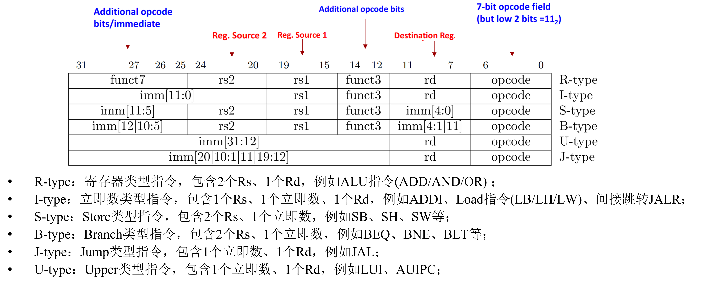
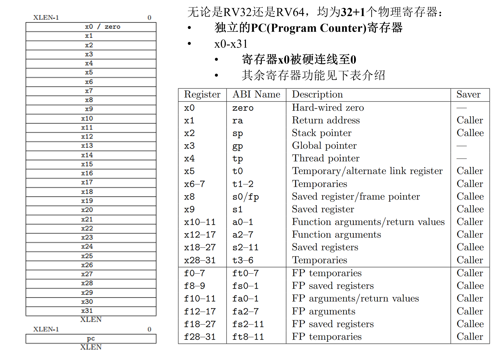

# 优势


RISC-V（Reduced Instruction Set Computing - V）是一种开源指令集架构（ISA），它有许多独特的优势，使其在现代计算领域受到越来越多的关注和应用。以下是RISC-V指令的主要优势：

### 1. 开源和自由

RISC-V 是一个开源指令集架构，任何人都可以自由地使用、修改和扩展它，而无需支付许可费。这种开放性使得研究人员、公司和开发者可以在其基础上进行创新和开发，推动了整个生态系统的发展。

### 2. 简单和精简

RISC-V 指令集设计简单且精简，遵循 RISC（精简指令集计算）的原则。这使得指令集更容易理解、实现和优化，同时也简化了硬件设计和验证的过程，降低了开发和制造成本。

### 3. 可扩展性

RISC-V 具有高度的模块化和可扩展性。基础指令集很小，但可以通过添加标准或自定义扩展来支持各种应用需求。例如，可以添加浮点运算扩展、矢量处理扩展、加密扩展等。这种设计使得 RISC-V 能够适应从嵌入式系统到高性能计算的各种应用场景。

### 4. 高效性能

由于其精简的设计，RISC-V 通常能够实现高效的指令执行和性能优化。更少的指令类型和一致的指令格式使得指令解码和流水线设计更加高效，这有助于提高处理器的性能和能效比。

### 5. 强大的社区支持

RISC-V 拥有一个活跃和不断增长的开发者和用户社区。这个社区提供了丰富的资源、工具和支持，包括编译器、操作系统、仿真器和开发板等。这种强大的社区支持推动了 RISC-V 技术的快速发展和广泛采用。

### 6. 灵活性和未来证明

RISC-V 的开放和模块化设计使得它具有很强的灵活性，能够快速适应新技术和市场需求。此外，RISC-V 基金会致力于维护和推广这一架构，确保其长期的稳定性和兼容性。

### 7. 学术和教育价值

由于其开放性和简洁性，RISC-V 非常适合用于学术研究和教育。学生和研究人员可以深入理解计算机架构的基本原理，动手设计和实现自己的处理器，同时还可以在实际项目中应用他们的知识。

### 8. 生态系统的快速发展

RISC-V 的开源性质和广泛的社区支持促进了整个生态系统的快速发展。越来越多的公司、学术机构和开源项目开始采用和支持 RISC-V，这进一步推动了工具链、软件和硬件平台的成熟。

总之，RISC-V 指令集的开源性、简洁性、可扩展性、高效性能以及强大的社区支持，使其成为现代计算领域中的一股重要力量，并有望在未来的计算技术发展中扮演重要角色。


# 指令类型





1.为什么S型指令没有Rd？答：因为是store

2.为什么立即数要切分到不同位置，连续存放不好吗？答：硬件好做mux

3.S型和B型指令的编码区别在哪里？答：B型没有imm[0]，相当于×2，可跳转±4KB (13位)

4.为什么要有U类型指令？答：jalr型的跳转范围仅有低12bit，使用AUIPC和LUI与JALR搭配，就可以实现32bit地址范围内随便跳。





RISC-V跳转指令是在RISC-V指令集架构中用于控制程序流的一类指令。它们可以用于实现条件跳转、无条件跳转和子程序调用等功能。以下是RISC-V中常见的跳转指令以及它们的区别和联系：

1. **无条件跳转指令 (JAL)**:
   - JAL (Jump and Link)指令用于无条件跳转到目标地址，并将当前指令的下一条地址（PC+4）保存到目标寄存器中，通常是ra (Return Address) 寄存器。这使得在子程序调用结束后可以返回到调用点。JAL指令的格式如下：
     ```
     JAL rd, offset
     ```
   - 其中，`rd`是目标寄存器，`offset`是相对于当前PC的偏移量。

2. **条件跳转指令 (JALR)**:
   - JALR (Jump and Link Register)指令用于有条件地跳转到目标地址，并将当前指令的下一条地址（PC+4）保存到目标寄存器中，通常是ra寄存器。它的格式如下：
     ```
     JALR rd, rs1, offset
     ```
   - 其中，`rd`是目标寄存器，`rs1`是用于计算目标地址的寄存器，`offset`是相对于`rs1`的偏移量。

3. **条件分支指令 (BRANCH)**:
   - RISC-V中的条件分支指令用于根据某些条件改变程序的执行路径。它们包括BEQ（等于）、BNE（不等于）、BLT（小于）、BGE（大于等于）、BLTU（无符号小于）和BGEU（无符号大于等于）等指令。这些指令将根据条件测试结果来确定是否跳转到目标地址。它们的格式类似于：
     ```
     BEQ rs1, rs2, offset
     ```
   - 其中，`rs1`和`rs2`是要比较的寄存器，`offset`是相对于当前PC的偏移量。

这些跳转指令的联系在于它们都能够修改程序的执行流程，但它们的具体行为和使用场景有所不同。JAL和JALR主要用于实现子程序调用和返回，而条件分支指令则用于根据条件执行不同的代码路径。实现这些跳转指令通常需要硬件支持，包括在流水线中正确处理分支延迟槽和处理异常情况等。


在RISC-V中，指令按照其格式和操作数的类型被分为不同的类型，主要包括R-type、I-type、S-type、B-type、U-type和J-type。下面是对RISC-V中常见跳转指令的类型归类：

1. **JAL (Jump and Link)**:
   - JAL是一种J-type指令。J-type指令是指格式中只有一个目标地址字段，用于进行无条件跳转。JAL指令的目标地址在指令本身中直接给出，因此它被归类为J-type指令。

2. **JALR (Jump and Link Register)**:
   - JALR是一种I-type指令。I-type指令一般用于包含一个立即数（immediate）或者一个小的地址偏移。JALR指令中，除了目标寄存器和源寄存器外，还包含了一个相对于源寄存器的地址偏移量，因此它属于I-type。

3. **条件分支指令 (BEQ、BNE、BLT等)**:
   - 条件分支指令通常是B-type指令。B-type指令用于条件分支，其格式包括两个源寄存器和一个相对于当前PC的偏移量。这些指令根据指定的条件进行跳转，因此归类为B-type。

总的来说，JAL属于J-type，JALR属于I-type，而条件分支指令通常属于B-type。


函数调用和返回涉及到寄存器的保存和恢复，以及跳转指令的执行。下面是函数调用和返回涉及的主要步骤：

### 函数调用（Call）：

1. **保存返回地址**：
   - 在调用函数之前，调用者需要保存当前函数的返回地址。通常使用JAL指令跳转到目标函数，并将下一条指令的地址（即当前指令的地址加上4）保存到一个特定的寄存器中（例如，ra寄存器）。

2. **传递参数**：
   - 调用者可能需要将参数传递给被调用函数。这通常通过将参数值放入特定的寄存器中，或者将参数值存储在内存中的某个位置，并将该位置的地址传递给被调用函数。

3. **跳转到被调用函数**：
   - 使用跳转指令（通常是JALR）来跳转到被调用函数的入口地址。

### 函数返回（Return）：

1. **保存返回值**：
   - 如果函数有返回值，被调用函数会将返回值存储在特定的寄存器中（例如，a0寄存器）。

2. **恢复调用者的上下文**：
   - 被调用函数需要恢复调用者的上下文，包括返回地址和其他可能被修改的寄存器。通常通过将之前保存的返回地址加载回PC寄存器，并将其他寄存器的值恢复为调用函数之前的状态来完成。

3. **返回到调用者**：
   - 使用跳转指令（通常是JALR）将控制流返回到调用者的下一条指令，通常是之前保存的返回地址。

在RISC-V中，JAL和JALR是常用的跳转指令，用于实现函数调用和返回。调用函数时，使用JAL指令保存返回地址并跳转到函数入口；返回时，使用JALR指令将控制流返回到保存的返回地址。同时，通过在函数调用之前保存和在返回之后恢复寄存器的值，可以保证函数调用和返回的正确性和可靠性。


# 指令集

##  指令集拓展

RISC-V (Reduced Instruction Set Computing - V) 是一种模块化和可扩展的开源指令集架构（ISA），其设计的核心理念之一就是允许用户根据特定需求扩展指令集。RISC-V 的指令集分为基础指令集和多个可选扩展指令集。这种设计使得 RISC-V 能够灵活地适应不同的应用场景，从简单的嵌入式系统到高性能计算。

以下是 RISC-V 如何拓展指令集的主要方式：

### 1. 基础指令集和标准扩展

RISC-V 指令集分为基础指令集（如 RV32I 和 RV64I）和多个标准扩展。基础指令集提供了最小可运行的指令集，而标准扩展则提供了额外的功能模块。例如：

- **M 扩展**（整数乘法和除法）
- **A 扩展**（原子指令）
- **F 扩展**（单精度浮点）
- **D 扩展**（双精度浮点）
- **C 扩展**（压缩指令）

这些扩展可以根据需求进行组合。例如，RV32IMAC 表示 32 位基础指令集加上整数乘法和除法、原子指令和压缩指令扩展。

### 2. 自定义扩展

RISC-V 允许用户定义自定义扩展以满足特定应用需求。自定义扩展通常用于特定领域的优化，例如图像处理、加密算法或特定硬件加速功能。

#### 自定义扩展的步骤：

1. **定义自定义指令**：根据应用需求设计新的指令。这些指令可以包含特定的操作码和功能。
2. **修改工具链**：修改编译器、汇编器和调试器等开发工具，以支持新的自定义指令。
3. **修改处理器实现**：在处理器硬件或模拟器中实现这些自定义指令的逻辑。
4. **验证和测试**：对新指令进行测试和验证，确保其正确性和性能。

### 3. 特殊用途扩展

RISC-V 社区和不同组织也在开发一些特殊用途的扩展。例如：

- **矢量扩展（Vector Extension, V）**：用于并行处理大量数据，适合于高性能计算和数据密集型应用。
- **硬件加速扩展**：用于特定算法的硬件加速，例如加密算法、机器学习推理等。

### 4. 扩展集的版本控制

RISC-V 基金会和社区定期发布新的扩展和更新版本，确保指令集的演进和兼容性。例如，随着时间的推移，新的扩展可能会被提议、讨论、批准并纳入标准。

### 示例：自定义扩展的具体实现

假设我们需要一个自定义扩展来加速特定的图像处理操作，可以按照以下步骤进行：

1. **定义新指令**：例如，增加一个指令 `IMGPROC`，其操作码为 `0x7B`，用于执行特定的图像处理操作。
2. **修改编译器**：在编译器中增加对 `IMGPROC` 指令的支持，使其能够识别并生成该指令。
3. **修改硬件**：在处理器设计中加入 `IMGPROC` 指令的硬件实现，确保其在硬件上能正确执行。
4. **测试与验证**：编写测试程序，使用 `IMGPROC` 指令进行图像处理操作，验证其功能和性能提升。

通过这种灵活的扩展机制，RISC-V 可以广泛适应不同的应用需求，推动计算技术的发展。

# 模式


| RV特权         | 涵盖内容                                                     |
| -------------- | ------------------------------------------------------------ |
| USER特权       | 特权性最低的特权模式，USER模式下只允许访问指定给普通用户模式的寄存器 |
| Machine特权    | 在Machine模式下，对内存、I/O 和所有的CSR都有着完全的使用权限 |
| Supervisor特权 | Supervisor模式下，不可以使用机器模式的CSR，并且受到 PMP 的限制。使用基于页表的虚拟内存，这个功能构成超级用户模式的核心，确立RISC-V内存虚拟化的条件 |
| Hypervisor特权 | Hypervisor模式下，在原来的三种模式下新增VS与VU两种特权模式，为RISC-V提供CPU虚拟化加速的硬件条件 |


RISC-V架构定义了几种不同的执行模式，其中一些主要模式包括用户模式、特权模式、机器模式等。这些模式在系统中的角色和权限不同，各有优缺点。

### 1. 用户模式（User Mode）：

- **角色**：用户模式是应用程序运行的默认模式。在用户模式下，应用程序只能访问其自身的内存空间和受限的系统资源。
- **权限**：用户模式下的程序没有直接访问底层硬件资源的权限，它们只能通过系统调用来请求操作系统提供的服务。
- **优点**：提供了安全性和隔离，防止应用程序直接访问或损坏系统资源，有助于保持系统的稳定性。
- **缺点**：需要通过系统调用来访问系统资源，这可能会引入额外的开销和延迟。

### 2. 特权模式（Privileged Mode）：

- **角色**：特权模式是操作系统内核运行的模式。在特权模式下，操作系统具有对系统资源的完全控制。
- **权限**：特权模式下的程序可以直接访问系统资源，并执行特权指令，如修改页表、设置中断处理程序等。
- **优点**：允许操作系统直接管理硬件资源，实现了更高级别的系统功能和服务。
- **缺点**：特权模式下的程序具有更高的权限，可能会导致系统稳定性和安全性问题，因此需要谨慎编写和管理特权级代码。

### 3. 机器模式（Machine Mode）：

- **角色**：机器模式是处理器运行的最低级别模式，通常用于启动和初始化系统以及进行调试和故障排除。
- **权限**：机器模式下的程序可以执行特权指令，例如对寄存器进行直接操作和控制处理器的行为。
- **优点**：机器模式提供了最高级别的控制和访问权限，可以进行底层的系统配置和管理。
- **缺点**：由于其特权级别高，需要谨慎使用，否则可能会导致系统不稳定或不安全。

这些模式在系统中相互配合，提供了对硬件资源的不同级别的访问和控制权限，从而实现了系统的安全性、稳定性和可靠性。