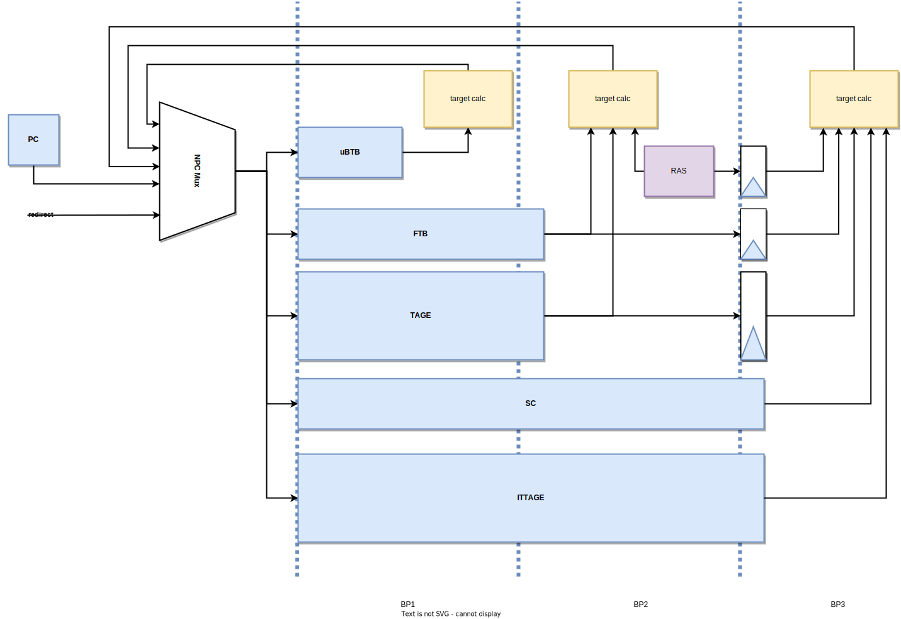
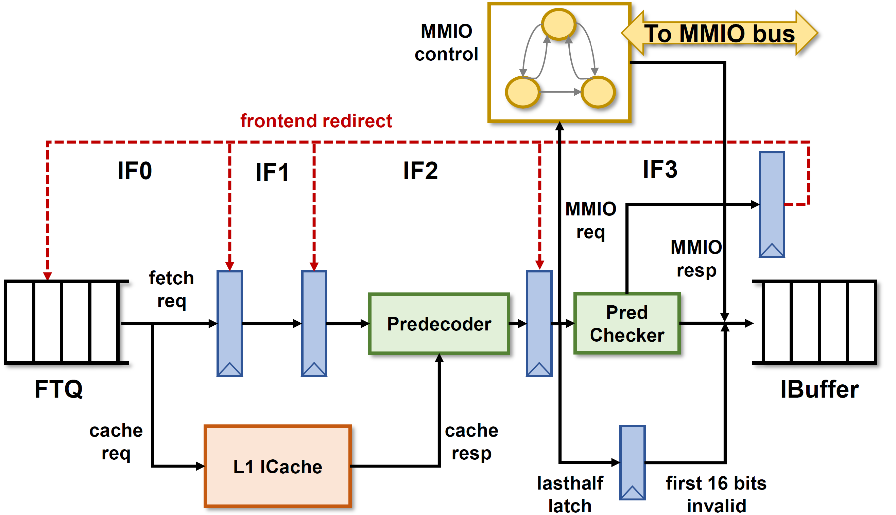
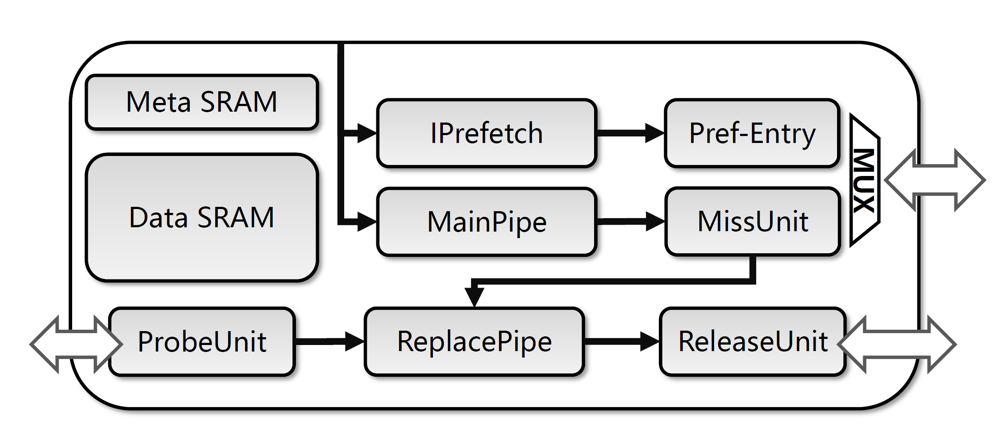
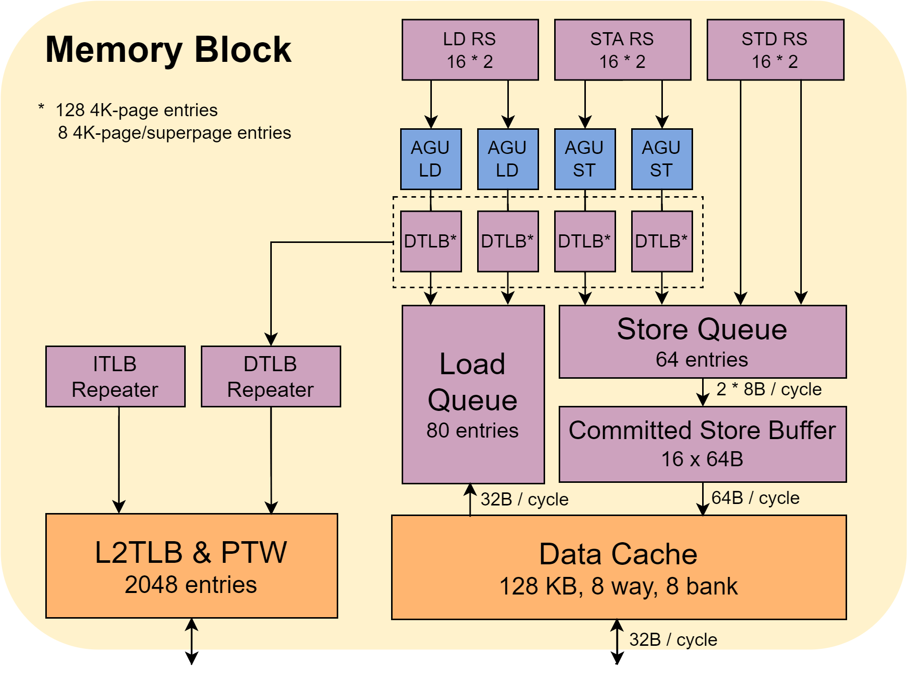
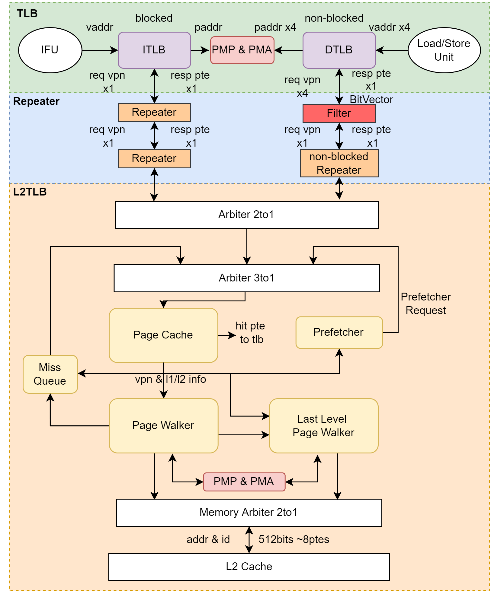

## 总体架构

乱序六发射结构设计，目前支持 RV64GCBK 扩展

RV64GCBK是RISC-V指令集架构（ISA）的一组扩展。每个字母代表一种特定的功能扩展，具体如下：

1. **G (General Purpose)**:
   - 这是一个通用目的扩展包，包含以下几个基础扩展：
     - **I**: 基本整数指令集
     - **M**: 乘法和除法指令
     - **A**: 原子操作指令
     - **F**: 单精度浮点数指令
     - **D**: 双精度浮点数指令

2. **C (Compressed Instructions)**:
   - 这个扩展提供了压缩指令，缩短常用指令的长度，减少代码的大小，提高指令缓存的效率和性能，特别适用于嵌入式系统。

3. **B (Bit-Manipulation)**:
   - 包含一系列位操作指令，例如位旋转、位计数、位交换等。这些指令对加速密码学、编码和数据压缩等应用非常有用。

4. **K (Cryptographic Extensions)**:
   - 这是安全扩展，提供了硬件支持的加密和哈希算法指令。例如AES（高级加密标准）、SHA-2（安全哈希算法）等，增强了处理器在加密和解密操作中的性能和安全性。

详细说明

- **General Purpose (G)**:
  - **I (Base Integer Instruction Set)**: 提供基本的整数运算指令，是所有RISC-V处理器的基础。
  - **M (Multiplication and Division)**: 增加了乘法和除法指令，支持有符号和无符号整数操作。
  - **A (Atomic Instructions)**: 包含原子性内存操作指令，如读-修改-写，用于多线程并发控制。
  - **F (Single-Precision Floating-Point)**: 支持32位单精度浮点数运算。
  - **D (Double-Precision Floating-Point)**: 支持64位双精度浮点数运算。

- **Compressed Instructions (C)**:
  - 通过使用16位指令替换某些常用的32位指令，减少了程序的大小，提高了指令缓存的命中率和执行效率。

- **Bit-Manipulation (B)**:
  - 增加了位操作指令集，如位旋转（rotate）、位提取（bit extract）、位插入（bit insert）、反转（reverse）等。这些操作对某些算法和数据处理非常有帮助，尤其是在密码学和图像处理等领域。

- **Cryptographic Extensions (K)**:
  - 包括硬件加速的加密和哈希操作指令，例如AES加密、SHA-256哈希算法等，显著提升了加密操作的性能和安全性。

这些扩展组合在一起，使RV64GCBK成为一个功能强大且多用途的指令集，适用于从高性能计算到安全应用的各种场景。

| 前端                                            | 后端                                                         | 访存子系统                                                   | 缓存                                                         |
| ----------------------------------------------- | ------------------------------------------------------------ | ------------------------------------------------------------ | ------------------------------------------------------------ |
| 分支预测单、取指单元 、指令缓冲等单元、顺序取指 | 译码、重命名、重定序缓冲、保留站、整型/浮点寄存器堆、整型/浮点运算单元 | 两条 load 流水线，两条 store addr 流水线，两条 store data 流水线。以及独立的 load 队列和 store 队列 | 缓存包括 ICache、DCache、L2/L3 Cache (HuanCun)、TLB 和预取器等模块 |

## 前端

### 总体架构

分支预测单元提供取指请求，写入一个队列，该队列将其发往取指单元，送入指令缓存。 取出的指令码通过预译码初步检查分支预测的错误并及时冲刷预测流水线，检查后的指令送入指令缓冲并传给译码模块，最终形成后端的指令供给。

### 分支预测 (Branch Prediction)

多级混合预测架构

| 下一行预测器(Next Line Predictor, NLP) | uBTB(micro BTB)                       |
| -------------------------------------- | ------------------------------------- |
| 精确预测器(Accurate Predictor, APD)    | FTB TAGE-SC ITTAGE RAS |

NLP: no bubble, 下一拍出预测结果

FTB、TAGE、RAS: 延迟2拍

SC、ITTAGE: 延迟3拍

三级流水线，覆盖预测器(overriding predictor)

### 取指目标队列(Fetch Target Queue, FTP)

FTQ是分支预测和取指单元之间的缓冲队列。**暂存BPU预测的取指目标**

### 取指单元(Instruction Fetch Unit, IFU)

### 指令缓存(Instruction Cache, ICache)

### 译码单元 (Decode Unit)

指令从指令缓存中取出，送进指令缓冲（队列）中暂存，然后以每周期 6 条的的速度送入译码单元译码，再传给下一个流水级。

## 后端

### 总体架构

处理器的流水线后端负责指令的重命名与乱序执行。

香山处理器后端可以分为 CtrlBlock、IntBlock、FloatBlock、Memblock 4 个部分， CtrlBlock 负责指令的译码、重命名和分派， IntBlock、FloatBlock、MemBlock 分别负责整数、浮点、访存指令的乱序执行。

- CtrlBlock
  - 译码 / 重命名 / 分派宽度 = 6
  - 发射前读寄存器堆
- IntBlock
  - 192 项物理寄存器(32*6)
  - 4 * ALU + 2 * MUL/DIV + 1 * CSR/JMP
- FloatBlock
  - 192 项物理寄存器
  - 4 * FMAC + 2 * FMISC
- MemBlock
  - 2 * LOAD + 2 * STORE （其中 STORE 分为 data 和 address 独立进行运算）

### 重命名 Rename

在乱序处理器中，重命名阶段负责管理和维护逻辑寄存器与物理寄存器之间的映射，通过对逻辑寄存器的重命名，实现指令间依赖的消除，并完成乱序调度。

重命名表的作用是维护逻辑寄存器与物理寄存器之间的映射关系，其操作端口包括一组读口 `readPorts` 和一组写口 `specWritePorts`。

### 派遣 Dispatch

两级流水级，第一级 `Dispatch` 负责将指令分类并发送至定点、浮点与访存三类派遣队列（Dispatch Queue），第二级 `Dispatch2Rs` 负责将对应类型的指令进一步根据不同的运算操作类型派遣至不同的保留站。

### 重定序缓冲 Re-Order Buffer (ROB)

## 访存子系统

### 总体架构

### 乱序访存机制

### 访存流水线

### LSQ

### MMU

TLB， L2TLB，Repeater，PMP 和 PMA 

为了实现进程隔离，每个进程都会有自己的地址空间，使用的地址都是虚拟地址。

香山处理器支持 Sv39 分页机制

- 虚拟地址长度为39位，低12比特是页内偏移
- 中间的27段分为三段，三层页表

如果ITLB和DTLB miss，会发送请求L2 TLB，当L2 TLB也miss，就会使用Hardware Page Table Walker去访问内存中页表的内容。

L2 TLB主要考虑如何提高并行度和过滤重复的请求。

Repeater是一级TLB到L2 TLB的请求缓冲。

PMP和PMA需要对所有的物理地址访问进行权限检查。

### 数据缓存

### 访存预测器

## L2/L3 Cache

## 其他

