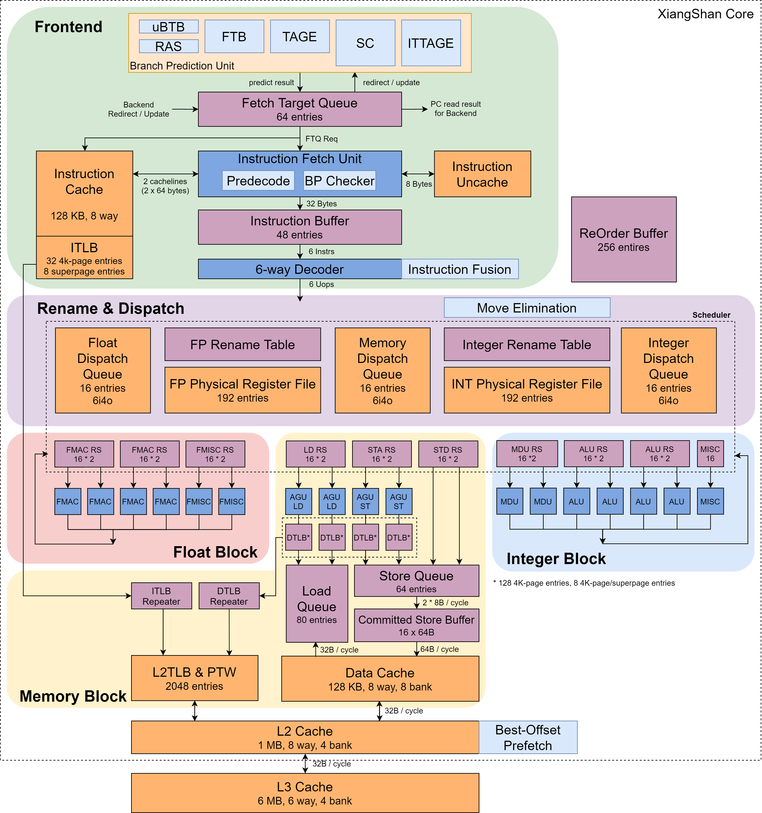
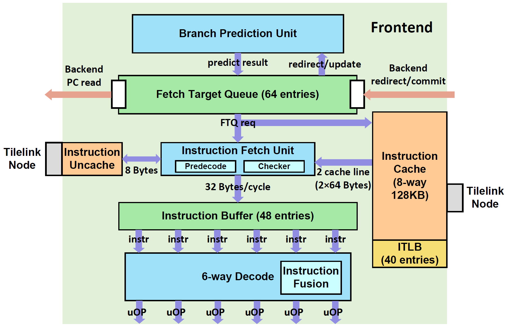

## 总体架构

乱序六发射结构设计，目前支持 RV64GCBK 扩展

RV64GCBK是RISC-V指令集架构（ISA）的一组扩展。每个字母代表一种特定的功能扩展，具体如下：

1. **G (General Purpose)**:
   - 这是一个通用目的扩展包，包含以下几个基础扩展：
     - **I**: 基本整数指令集
     - **M**: 乘法和除法指令
     - **A**: 原子操作指令
     - **F**: 单精度浮点数指令
     - **D**: 双精度浮点数指令

2. **C (Compressed Instructions)**:
   - 这个扩展提供了压缩指令，缩短常用指令的长度，减少代码的大小，提高指令缓存的效率和性能，特别适用于嵌入式系统。

3. **B (Bit-Manipulation)**:
   - 包含一系列位操作指令，例如位旋转、位计数、位交换等。这些指令对加速密码学、编码和数据压缩等应用非常有用。

4. **K (Cryptographic Extensions)**:
   - 这是安全扩展，提供了硬件支持的加密和哈希算法指令。例如AES（高级加密标准）、SHA-2（安全哈希算法）等，增强了处理器在加密和解密操作中的性能和安全性。

详细说明

- **General Purpose (G)**:
  - **I (Base Integer Instruction Set)**: 提供基本的整数运算指令，是所有RISC-V处理器的基础。
  - **M (Multiplication and Division)**: 增加了乘法和除法指令，支持有符号和无符号整数操作。
  - **A (Atomic Instructions)**: 包含原子性内存操作指令，如读-修改-写，用于多线程并发控制。
  - **F (Single-Precision Floating-Point)**: 支持32位单精度浮点数运算。
  - **D (Double-Precision Floating-Point)**: 支持64位双精度浮点数运算。

- **Compressed Instructions (C)**:
  - 通过使用16位指令替换某些常用的32位指令，减少了程序的大小，提高了指令缓存的命中率和执行效率。

- **Bit-Manipulation (B)**:
  - 增加了位操作指令集，如位旋转（rotate）、位提取（bit extract）、位插入（bit insert）、反转（reverse）等。这些操作对某些算法和数据处理非常有帮助，尤其是在密码学和图像处理等领域。

- **Cryptographic Extensions (K)**:
  - 包括硬件加速的加密和哈希操作指令，例如AES加密、SHA-256哈希算法等，显著提升了加密操作的性能和安全性。

这些扩展组合在一起，使RV64GCBK成为一个功能强大且多用途的指令集，适用于从高性能计算到安全应用的各种场景。

| 前端                                            | 后端                                                         | 访存子系统                                                   | 缓存                                                         |
| ----------------------------------------------- | ------------------------------------------------------------ | ------------------------------------------------------------ | ------------------------------------------------------------ |
| 分支预测单、取指单元 、指令缓冲等单元、顺序取指 | 译码、重命名、重定序缓冲、保留站、整型/浮点寄存器堆、整型/浮点运算单元 | 两条 load 流水线，两条 store addr 流水线，两条 store data 流水线。以及独立的 load 队列和 store 队列 | 缓存包括 ICache、DCache、L2/L3 Cache (HuanCun)、TLB 和预取器等模块 |

## 前端

### 总体架构

### 分支预测 (Branch Prediction)
